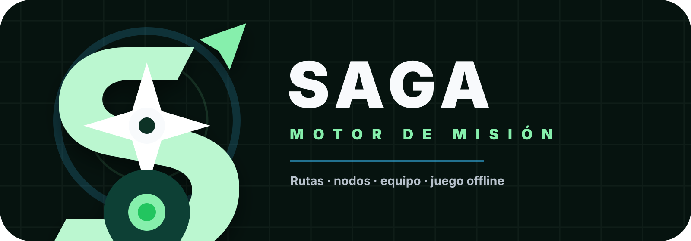

# SAGA Engine — Field Mission Platform

<div align="center">



**Un motor de misiones de campo geolocalizado, en tiempo real y offline-first.**  
Diseñado para experiencias de juego presencial con equipos, QR físicos, GPS y minijuegos.

[](CHANGELOG.md)
[](LICENSE)
[](https://python.org)
[](https://react.dev)
[](Dockerfile)

</div>

---

## ¿Qué es SAGA Engine?

SAGA Engine es una plataforma completa para diseñar y ejecutar **misiones de campo gamificadas** en el mundo real. Los jugadores reciben una ruta de nodos GPS, escanean QRs físicos, completan minijuegos y acumulan logros — todo ello funciona tanto con conexión como sin ella.

Pensado para **escape rooms urbanos, gymkhanas, formaciones corporativas, tours guiados** y cualquier experiencia donde quieras convertir el espacio real en un tablero de juego.

---

## Características principales

### 🗺️ Mapa en tiempo real
- Mapa interactivo basado en **Leaflet + OpenStreetMap** con nodos de misión geolocalizados
- Indicador de posición GPS del jugador con seguimiento dinámico
- Cálculo de distancia al nodo activo y radio de activación configurable
- Vista de ruta completa y modo "overview" de toda la misión
- Marcadores de equipo en tiempo real sobre el mapa

### 📡 GPS y localización
- Soporte completo de **GPS del navegador** con retroalimentación de precisión
- Modo **debug de geolocalización** para pruebas desde escritorio (permite mover manualmente la posición)
- Petición de GPS en el Login con flujo de permiso claro
- Entrada sin GPS permitida, con solicitud de posición simulada en debug

### 📦 Offline-first
- **Service Worker PWA** con caché de assets y shell del jugador
- **Mission Pack**: descarga completa de la misión para jugar sin conexión
- **Caché de teselas de mapa** (tiles) con precarga configurable antes de salir al campo
- Sincronización automática de progreso offline cuando vuelve la conexión
- Pruebas de campo (fotos) almacenadas localmente y sincronizadas después

### 🎮 Minijuegos (Game Families)
Sistema extensible de familias de minijuegos. En v1.1.0 incluye:

| Family | Descripción |
|---|---|
| **Matriz de Circuitos** | Conecta circuitos en una cuadrícula para encender nodos |
| **Código Secuencial** | Descifra y replica una secuencia de colores / símbolos |
| **Mosaico de Lugar** | Reconstruye una imagen fragmentada del lugar |
| **Laberinto de Equilibrio** | Laberinto controlado por el acelerómetro |
| **Desafío de Audio (Audio Challenge)** | Escucha, identifica patrones o resuelve acertijos sonoros |

Cada familia tiene editor visual en el panel de administración y runtime propio en el cliente.

### 🎒 Mochila del jugador
- Inventario con objetos recolectables (coleccionables, pistas, ítems de misión)
- Previsualización del siguiente nodo y su juego asociado
- Descripción contextual de cómo se juega cada minijuego
- Guía de herramientas integrada (asistente de campo)
- Descarga de fotos de campo como ZIP

### 👥 Multijugador y equipos
- Perfiles de jugador y equipos configurables desde el admin
- Presencia de equipo en tiempo real (posiciones en el mapa)
- Soporte para modos solo y equipo

### 🔑 Nodos físicos y QR
- Generación de tarjetas QR físicas desde el admin (QR Studio)
- Validación de QR con lógica de distancia — aviso centrado en pantalla si el jugador está demasiado lejos
- Soporte para tipos de nodo físico: Objeto QR, Llave QR, Pista QR, Bonus Oculto
- Panel de preview de requisitos antes de activar un nodo

### 📸 Pruebas de campo (Field Proofs)
- Captura de fotos geolocalizadas desde el cliente jugador
- Visor de fotos sobre el mapa con superposición de posición
- Eliminación de fotos propias
- **Descarga en ZIP** desde el panel de herramientas del jugador y desde el admin

### 🛠️ Panel de administración
- Constructor de misiones con nodos, etapas y rutas
- Editor visual de minijuegos por familia
- Gestión de jugadores y perfiles de equipo
- Mapa de misión en admin con vista de posiciones en vivo
- QR Studio para generar y gestionar tarjetas QR imprimibles
- Configuración de la misión, idioma y parámetros globales
- Offline Vault: resumen del estado de preparación offline de cada jugador

---

## Arquitectura

```
saga_engine/
├── main.py                    # FastAPI app principal
├── requirements.txt           # Dependencias Python
├── Dockerfile                 # Imagen Docker (Python 3.13-slim)
├── frontend/                  # App React (Vite + TypeScript)
│   ├── src/
│   │   ├── App.tsx            # Router raíz (Login / Player / Admin)
│   │   ├── login/             # LoginApp — selección de jugador + GPS
│   │   ├── player/            # PlayerApp — mapa, HUD, mochila, minijuegos
│   │   │   ├── components/    # PlayerHud, PlayerShell, MapSurface…
│   │   │   ├── minigames/     # Core + familias de minijuegos
│   │   │   ├── offline/       # PWA, Mission Pack, GPS cache…
│   │   │   └── utils/         # GPS, geo, stagePosition…
│   │   ├── admin/             # AdminApp — panel de administración
│   │   └── shared/            # API, tipos, identidad, offline vault…
│   └── public/                # Assets estáticos, manifest PWA, SW
├── scripts/                   # Scripts de despliegue y auditoría
└── tests/                     # Tests de backend (pytest)
```

**Stack:**
- **Backend**: Python 3.13 + FastAPI + SQLite (vía adaptadores)
- **Frontend**: React 19 + TypeScript + Vite + Leaflet
- **Deploy**: Docker (imagen única), desplegable en Raspberry Pi 4 o cualquier servidor Linux
- **PWA**: Service Worker con estrategia offline-first

---

## Inicio rápido

### Prerrequisitos
- Docker
- (Opcional) Node.js 20+ para desarrollo frontend local

### Producción (Docker)

```bash
# Clonar
git clone https://github.com/tu-usuario/saga_engine.git
cd saga_engine

# Configurar entorno
cp prod.env.example prod.env
# Editar prod.env con tus valores

# Construir y arrancar
docker build -t saga_engine:latest .
docker run -d \
  --name saga_engine_app \
  -p 8096:5000 \
  --env-file prod.env \
  -v $(pwd)/data:/app/data \
  saga_engine:latest
```

### Deploy seguro (con smoke test)
El script `deploy_saga_safe.sh` levanta primero un candidato en puerto alternativo, hace smoke test, y solo promueve si todo va bien:

```bash
bash scripts/deploy_saga_safe.sh saga_engine:latest --build --promote
```

### Desarrollo local (frontend)
```bash
cd frontend
npm install
npm run dev
# → http://localhost:5173
```

---

## Variables de entorno

| Variable | Descripción | Ejemplo |
|---|---|---|
| `SECRET_KEY` | Clave secreta para sesiones admin | `cambiar-en-produccion` |
| `ADMIN_PASSWORD` | Contraseña del panel de admin | `mi-password` |
| `SAGA_VERSION` | Versión mostrada en el cliente | `1.1.0` |
| `SAGA_BUILD_TIME` | Timestamp de compilación | `2026-06-23T14:00:00+0200` |
| `DATA_DIR` | Directorio de datos persistentes | `/app/data` |

---

## Configuración de misión

La misión se configura desde el **panel de administración** (`/admin-react`):

1. **Settings** → Nombre de la misión, historia, idioma, jugadores
2. **Mission Builder** → Crear nodos con coordenadas GPS y radio de activación
3. **Node Editor** → Asignar familia de minijuego y configurar sus parámetros
4. **Physical QR** → Generar y descargar tarjetas QR imprimibles
5. **Players** → Gestionar perfiles de jugador y equipos
6. **Offline Prep** → Verificar que todos los jugadores tienen la misión descargada

---

## GPS y modo debug

En entornos sin GPS real (escritorio, pruebas):
1. Entra al jugador desde `/player/TU-JUGADOR`
2. En la barra inferior → botón de debug 🐛
3. Pulsa en el mapa para simular tu posición

Para pruebas de distancia a nodos, usa el modo debug para colocarte dentro del radio del nodo activo.

---

## Despliegue en Raspberry Pi

El sistema está optimizado para correr en una **Raspberry Pi 4 (arm64)**:

```bash
# En la Pi
git clone https://github.com/tu-usuario/saga_engine.git
cd saga_engine

# Primera vez
docker build -t saga_engine:latest .
bash scripts/deploy_saga_safe.sh saga_engine:latest --promote

# Actualizaciones
# (desde el PC de desarrollo, subir los cambios a la Pi y re-ejecutar)
bash scripts/deploy_saga_safe.sh saga_engine:latest --build --promote
```

El script gestiona automáticamente:
- Construcción de imagen nueva
- Prueba en puerto alternativo (18096)
- Smoke test de las rutas principales
- Promoción a producción (8096) solo si todo va bien
- Limpieza del candidato

---

## Tests

```bash
# Instalar dependencias de test
pip install -r requirements-dev.txt

# Ejecutar todos los tests
pytest tests/ -v

# Tests específicos
pytest tests/test_game_state_repository.py -v
pytest tests/test_offline_progression_sync_api.py -v
```

---

## Changelog

Ver [CHANGELOG.md](CHANGELOG.md) para el historial completo de versiones.

---

## Licencia

MIT — ver [LICENSE](LICENSE)

---

<div align="center">

Construido con ❤️ para misiones de campo reales.  
**SAGA Engine v2.0.0** — 2026

</div>
